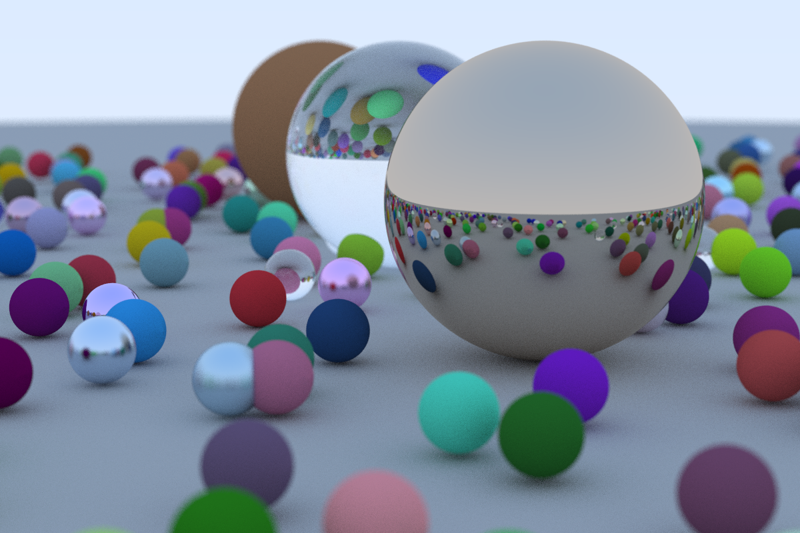

# Raytracer Rust

Implementation of a raytracer written in rust. You would need a [ppm viewer](https://www.cs.rhodes.edu/welshc/COMP141_F16/ppmReader.html) to view the images that have been generated in the [images](/images/) folder.

## Pre-requisites
You would need Rust and cargo installed on your machine to run this. For more info, click [here](https://www.rust-lang.org/tools/install).

## Running
In your terminal, enter `cargo run` and it would run. The final scene which will look like:

## Resources
1. [Scratch a Pixel](https://www.scratchapixel.com/)
2. [RayTracing In One Weekend](https://raytracing.github.io/books/RayTracingInOneWeekend.html)